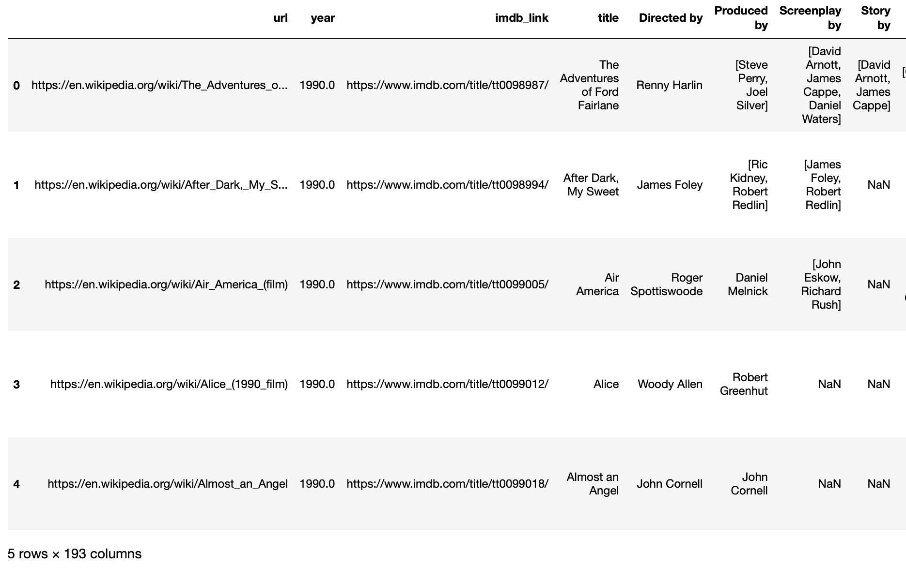
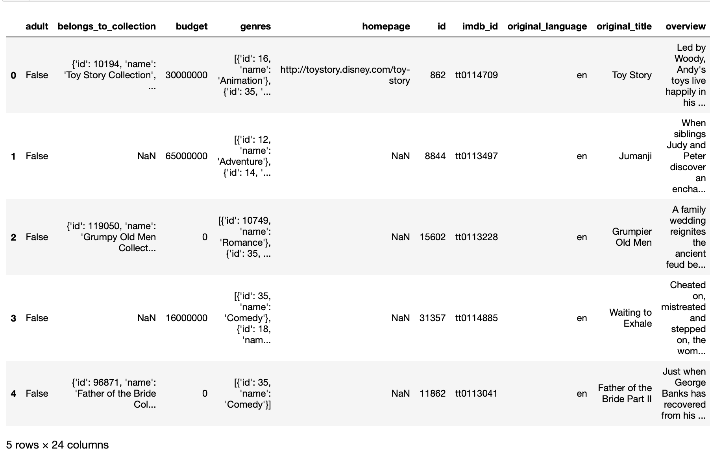
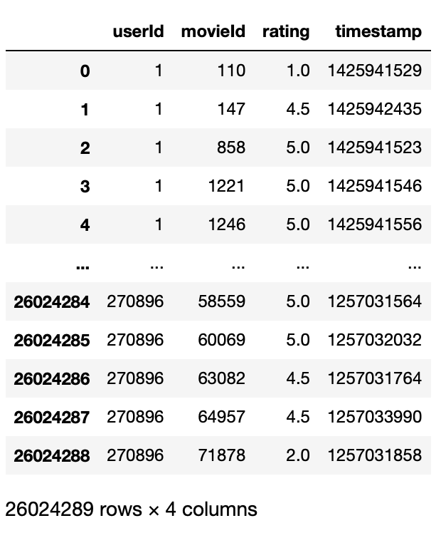
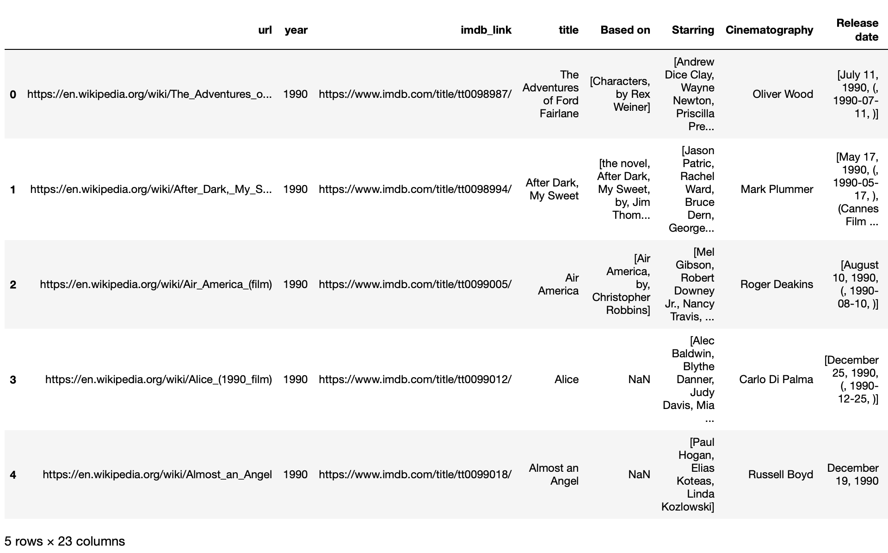
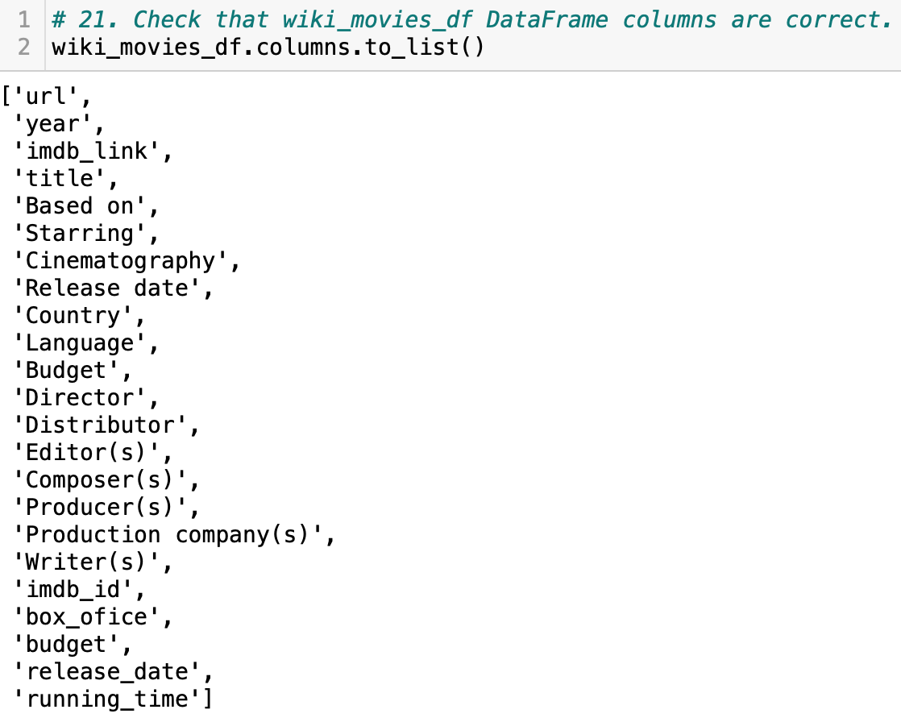
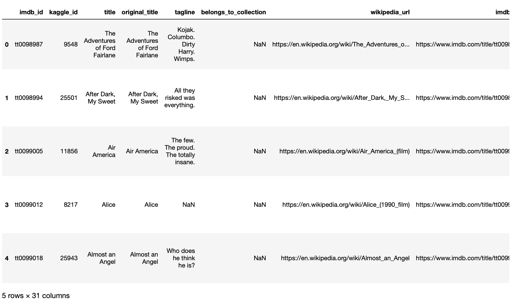
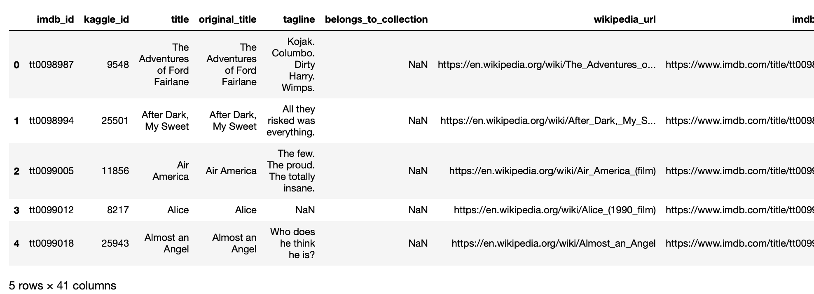
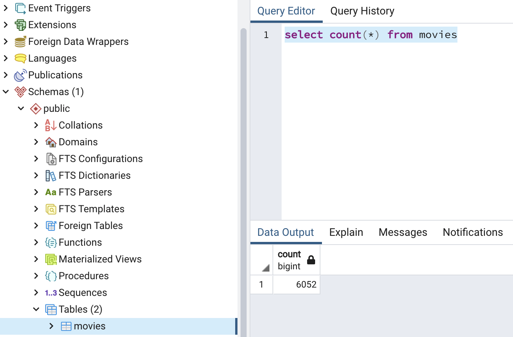
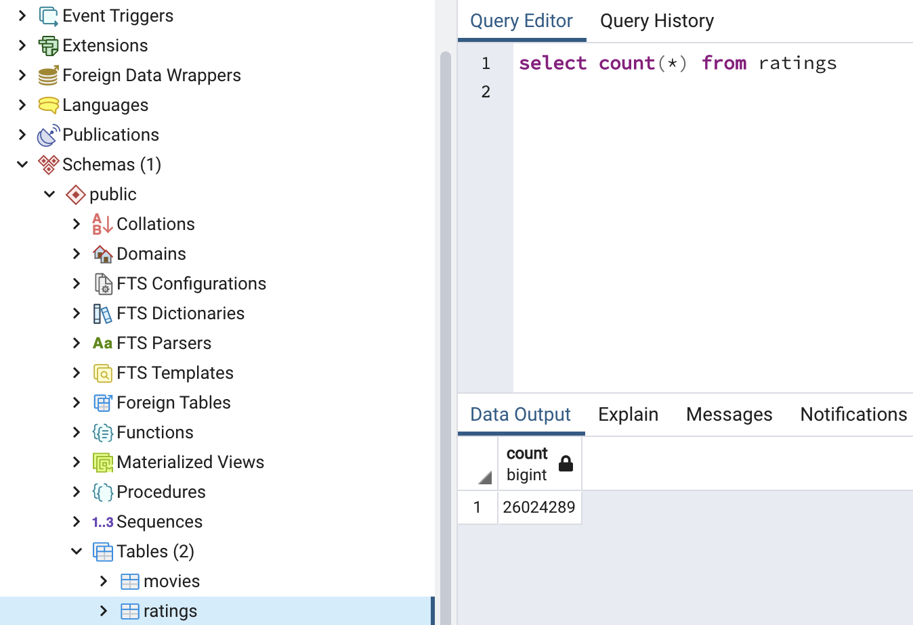

# Movies-ETL

## Overview of Project

In this project, Amazing Prime Video which is a platform for streaming movies and TV shows on Amazing Prime would like to develop an algorithm for predicting which low budget movie is going to be popular so that they could purchase the streaming rights at a bargain. As a result of this, Amazing Prime team have decided to sponsor a hackathon and providing a clean data set of movie data to ask the participants to perform the prediction for them. 

### Purpose

The purpose of this project is help Britta who is a member of the Amazing Prime Video team with creating the clean dataset for the hackathon by refactoring a previously written code. The data sources that we are provided with are in terms of a scrape of Wikipedia for all movies released since 1990, Kaggle  metadata and rating data from the Movie Land's website. Therefore, it is required to construct an automated pipeline that takes in new data from the datasets, transform the dataset into one clean data and finally load the data into PostgreSQL database by creating one function that takes in the Wikipedia data, Kaggle metadata, and the MovieLens rating data.

## Resources

Jupyter Notebook Files: [ETL_function_test.ipynb](ETL_function_test.ipynb), [ETL_clean_wiki_movies.ipynb](ETL_clean_wiki_movies.ipynb), [ETL_clean_kaggle_data.ipynb](ETL_clean_kaggle_data.ipynb), [ETL_create_database.ipynb](ETL_create_database.ipynb)

## Results

This section of the report focuses on the extraction of dataset from the required website in CSV and json formats followed by transformation of the dataset into one clean data and finally loading the dataset into SQL table. The results achieved are displayed in forms of Pandas DataFrames.

### ETL Function 

In this portion of the project, knowledge of Python, Pandas and ETL process was utilized for writing a function that read in the wiki, Kaggle and ratings data files for creating the wiki_movies, kaggle_metadata and ratings DataFrames. This was achieved by initially reading the Kaggle metadata and MovieLens ratings CSV file as Pandas DataFrames and opening as well as loading the Wikipedia JSON file for converting the JSON data to raw data. The DataFrames were then achieved from the return statements as shown in figures below.

*The wiki_movies_df DataFrame:*

*The kaggle_metadata DataFrame:*

*The ratings DataFrame:*

### Extract and Transform the Wikipedia Data

In this portion of the project extraction and transformation of the Wikipedia data was performed for merging it with the Kaggle metadata. The transformation process was performed using python list comprehension, regular expressions as well as apply and map methods with lambda functions. Furthermore, the wiki_movies DataFrame was cleaned by cleaning the box office, budget, release date and running time columns. Figure below displays the cleaned wiki_movies_df that has been cleaned. As it can be seen, the columns were reduced from 193 to only 23 columns.

Figure below depicts the column names of the wiki_movies_df DataFrame that were added to a list.

### Extract and Transform the Kaggle Data

In this part of the project, the Kaggle metadata and MovieLens rating data were extracted and transformed and were then converted into separate DataFrames. Furthermore, the Kaggle metadata DataFrame was then merged with the Wikipedia movies DataFrame for creating movies_df DataFrame. After achieving the movies_df, the DataFrames was further filtered by dropping unnecessary columns and filling missing data as illustrated in the figure below.

Lastly, the MovieLens rating data DataFrame was merged with the movies_df DataFrame for creating the movies_with_ratings_df as depicted in the figure below. 

### SQL Database

In this portion of the project, the last stage of ETL process in terms of loading the movies_df DataFrame and MovieLens ratings into SQL movies database was carried out. This was performed by creating a connection to the PostgreSQL database using SQLAlchemy which is a library that allows communication between python and databases. After adding the movies_df DataFrame as movies and MovieLens rating CSV data as ratings to SQL database the count query was run on PostgreSQL database for retrieving the number of rows for the movies and ratings tables.

## Summary

In conclusion, this project was performed with the use of Python, Pandas, the ETL process and code refactoring. The extraction, transformation and loading process was done successfully and this was confirmed after achieving the number of rows for the movies and ratings tables to be **6,052** and **26,024,289** respectively as shown in figures below.

*Movies Query:*

*Ratings Query:*

